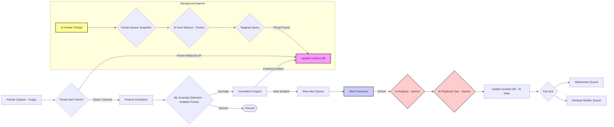

# NetSentinel: AI-Powered Real-Time Network Guardian 🛡️🤖

**_Your intelligent, proactive watchdog for network security._**

[](https://opensource.org/licenses/MIT) 
[](https://www.python.org/) 
[](https://fastapi.tiangolo.com/)
[](https://scapy.net/)
[](https://scikit-learn.org/)
[](https://ai.google.dev/)


## 🚀 Introduction

Modern networks face a relentless barrage of sophisticated cyber threats. Traditional monitoring tools often drown users in logs, react too slowly, or miss subtle anomalies that precede major attacks.

**NetSentinel** transforms network security by providing real-time, intelligent anomaly detection powered by Machine Learning and Generative AI. It doesn't just watch your network; it *understands* it, *learns* its normal behavior, *hunts* for hidden threats, and provides *actionable* intelligence and response capabilities.

Built for performance and insight, NetSentinel is your smart network co-pilot.


## ✨ Key Features

* **🧠 Intelligent Anomaly Detection:** Uses unsupervised ML (Isolation Forest) to detect unusual network behavior without needing pre-defined rules. Learns your network's baseline and adapts over time.
* **🤖 AI-Powered Analysis:** Leverages Google Gemini to:
    * Generate human-readable summaries for every incident.
    * Map detected activities to the industry-standard **MITRE ATT&CK® framework**.
    * Create **step-by-step incident response playbooks** for critical threats.
* **🕵️‍♂️ Proactive AI Threat Hunter:** An autonomous AI agent ("Watchdog") that actively hunts for subtle, behavioral threats (like lateral movement or low-and-slow exfiltration) that statistical models might miss.
* **🌐 Real-Time Threat Intelligence:** Integrates with AbuseIPDB to instantly flag connections involving known malicious IP addresses.
* **📜 Incident Correlation & Storytelling:** Groups related anomalous events into a single "Incident" and provides a full timeline ("Threat Story") via API.
* **🚨 Multi-Channel Alerting:** Delivers real-time alerts via:
    * **WebSocket:** For the live web dashboard.
    * **Desktop Notifications:** Native OS pop-ups for immediate awareness (using Plyer).
* **⚔️ Attack Simulation & Digital Twin:** Built-in API to simulate attacks (Port Scans, UDP Floods) safely against your detection engine, perfect for demos and testing.
* **🍯 Simulated Mitigation API:** Allows "blocking" or "sending to honeypot" attacker IPs via API call, demonstrating response capabilities.
* **⚡ Real-Time Packet Analysis:** Captures and analyzes network traffic at the packet level using Scapy.
* **💾 Adaptive Model Persistence:** Trains a custom ML model on *your* network's traffic on the first run and saves it for instant-on protection thereafter.

---

## 📊 How It Works (High-Level Flow)

NetSentinel operates through a streamlined, multi-stage pipeline:


**Capture & Check**: Live network packets are captured. External IPs are immediately checked against the AbuseIPDB threat intelligence feed. Known bad IPs trigger an instant incident.

**ML Detection**: If IPs are clean/internal, features are extracted, and an Isolation Forest model flags statistically anomalous packets.

**Correlation**: Anomalous events are grouped by attacker IP into Incidents to avoid alert spam.

**Processing & AI Enrichment**: New incidents are picked up by a central processor, which uses Google Gemini to generate a summary, map to MITRE ATT&CK, and create a response playbook.

**Fan-Out**: The enriched alert is sent to both the WebSocket (for the dashboard) and the desktop notification system.

**AI Hunting (Parallel)**: A separate AI agent periodically analyzes recent traffic patterns, hunts for behavioral threats, and creates incidents if found.

🛠️ **Tech Stack**
Backend: Python 3.9+
API Framework: FastAPI
Packet Manipulation: Scapy
Machine Learning: Scikit-learn (Isolation Forest), Pandas, NumPy
Generative AI: Google Generative AI SDK (for Gemini)
Threat Intelligence: Requests (for AbuseIPDB API)
Desktop Notifications: Plyer
Model Persistence: Joblib
WebSockets: Built into FastAPI/Starlette
Server: Uvicorn
Frontend (Example): React / Dash (or any WebSocket client)


⚙️ **Getting Started / Setup**
Follow these steps to get NetSentinel running locally.
**Prerequisites**
Python: Version 3.9 or higher installed.
pip: Python package installer.
Git: Version control system.
Root/Administrator Privileges: Required for Scapy to perform packet sniffing.

**Installation**
Clone the Repository:
Bash
git clone [https://github.com/Faham-from-nowhere/NetSentinel-2.0.git](https://github.com/Faham-from-nowhere/NetSentinel-2.0.git)

cd NetSentinel

**Create & Activate Virtual Environment:**
Bash
# Windows
python -m venv venv
.\venv\Scripts\activate
# macOS / Linux
python3 -m venv venv
source venv/bin/activate

**Install Dependencies:**
Bash
pip install -r requirements.txt

**Set Up API Keys:**
Create a file named .env in the project root directory (netsentinel-backend).
Add your API keys (get them from Google AI Studio and AbuseIPDB):
Ini, TOML
# .env
GEMINI_API_KEY=YOUR_GEMINI_API_KEY_HERE
ABUSEIPDB_API_KEY=YOUR_ABUSEIPDB_API_KEY_HERE

**Running the Backend**
Open your terminal with Administrator/Root privileges. This is crucial for Scapy.
Navigate to the backend directory:
Bash
cd netsentinel-backend
Activate the virtual environment (if not already active).

**Run the FastAPI server:**
Bash
python main.py
The server will start on http://localhost:8000 (or 8001 if you changed the port).

**First Run**: It will collect TRAINING_PACKET_COUNT (default 500) packets to train the ML model and save it to netsentinel_model.joblib. This might take a minute or two.

**Subsequent Runs**: It will load the saved model instantly.

**Running the Frontend**
Navigate to the frontend directory (assuming one exists).

Install frontend dependencies (e.g., npm install).

Start the frontend development server (e.g., npm start).

Access the dashboard in your browser (usually http://localhost:3000).

🕹️ **Usage / Demo Guide**
Access the Dashboard: Open your browser to the frontend URL (e.g., http://localhost:3000) or use a WebSocket test tool (like PieSocket) connected to ws://localhost:8000/ws/live.
**Monitor**: Watch the backend terminal logs and the connected client. You'll see:

ML model training/loading messages.

Periodic analysis logs ([Analyzer] Analyzing...).

AI Hunter logs ([AI Hunter] Waking up...).

**Trigger an Alert (Simulation)**:
Open the API docs in your browser: http://localhost:8000/docs.

Scroll down to the Simulator API section.

Execute POST /api/simulate/portscan or POST /api/simulate/udpflood
.
**Observe the Response**:
Terminal: You'll see the simulator start, the analyzer detect anomalies, an incident being created, the AI analysis/playbook generation, and the alert being fanned out.

Desktop: A native notification should pop up.

WebSocket Client/Dashboard: The alert JSON (including AI summary and MITRE mapping) will appear.

**View Incident Details**:
Copy the incident_id from the alert (e.g., INC-REAL-XXXX).

Use the API docs or your browser to access GET /api/incident/{incident_id} (e.g., http://localhost:8000/api/incident/INC-REAL-XXXX).

Observe the full JSON, including the complete sequence (Threat Story) and the ai_playbook.

**Simulate Mitigation**:
Use the API docs to execute POST /api/mitigate/block_ip/{ip_address} with an attacker IP (e.g., 127.0.0.1 for simulations).

Verify the block by executing GET /api/mitigate/blocked_ips.

📂 **Project Structure (Backend)**
``` netsentinel-backend/
├── venv/                   # Virtual environment
├── .env                    # API Keys (Gitignored)
├── .gitignore              # Files ignored by Git
├── ai_analyst.py           # Gemini AI integration (Summary, MITRE, Playbook)
├── ai_hunter.py            # AI Watchdog proactive threat hunter
├── attack_simulator.py     # Functions to generate simulated attack traffic
├── main.py                 # FastAPI app, API endpoints, WebSocket, background tasks
├── packet_analyzer.py      # Scapy capture, ML detection, Correlation, Threat Intel
├── netsentinel_model.joblib # Saved ML model (Gitignored)
├── requirements.txt        # Python dependencies
└── README.md               # This file
```

🗺️ **Future Roadmap**
**Real Honeypot Integration**: Implement actual firewall rule changes to redirect attackers to a dedicated honeypot server (e.g., using Docker).

**Enhanced Simulations**: Add more sophisticated attack simulations (e.g., slow data exfiltration, specific malware C2 patterns).

**Notification Integrations**: Send alerts via Slack, Discord, or Email bots.

**Hybrid Model Training**: Ship a basic pre-trained model for instant use while the custom model trains in the background.

**Frontend Dashboard**: A dedicated React/Dash frontend with visualizations (network map, traffic graphs, alert dashboard).

**Configuration File**: Move settings like thresholds and API endpoints to a config file.

**Database**: Use a proper database (like SQLite or PostgreSQL) instead of in-memory dictionaries for persistence.

🤝**Contributing**
(Fork, Branch, Pull Request)

🙏 **Acknowledgements**
Hackathon Organizers

Google for the Gemini API

AbuseIPDB for the Threat Intelligence feed

**The open-source community for libraries like FastAPI, Scapy, Scikit-learn, Plyer.**


